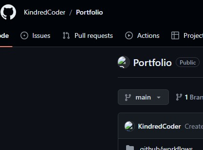

<!DOCTYPE html>
<html lang="en">
<head>
    <meta charset="UTF-8">
    <meta name="viewport" content="width=device-width", initial-scale="1.0">
    <title>My Portfolio</title>
    <link rel="stylesheet" href="styles.css">
</head>
<body>
    <header>
        <h1>Welcome to My Portfolio</h1>
        <nav>
            <ul>
                <li><a href="#about">About</a></li>
                <li><a href="#projects">Projects</a></li>
                <li><a href="#contact">Contact</a></li>
                <li><a href="https://meritpages.com/kgibs">Education</a></li>
            </ul>
        </nav>
    </header>
    <main>
        <section id="about">
            
            <h2>About Me</h2>
            
Currently Attending SNHU to persue a degree in Computer Science with an emphasis on Software Engineering.

            
Enjoys spending time with 

            <h3>Skills and Languages I'm currently working on.</h3>
            <button id="toggleSkillsButton">Show Skills</button>
                <ul id="skillsContent" style="display: none;">
                    <li>JavaScript</li>
                    <li>Python</li>
                    <li>HTML & CSS</li>
                    <li>React</li>
                    <li>C++</li>
                    <li>JAVA</li>
                </ul>  
        </section>
        <section id="projects">
            <h2>Projects</h2>
            <button id="toggleProjectsButton">Show Projects</button>
            

                

                    <h3>Project 1</h3>
                    
                    
Details about my projects will go here.

                    <a href="https://github.com/KindredCoder/Portfolio" target="_blank">View on GitHub</a>
                

                

                    <h3>Project 2</h3>
                    
                    
A breif description of Project 2.

                    <a href="https://github.com/KindredCoder/Portfolio" target="_blank">View on GitHub</a>
                

                <!--- Add more projects here, later -->
            

        </section>
        <section id="contact">
            <h2>Contact Me</h2>
            
            <form id="contactForm">
                <label for="name">Name:</label>
                <input type="text" id="name" name="name" required>

                <label for="email">Email:</label>
                <input type="email" id="email" name="email" required>

                <label for="message">Message:</label>
                <textarea name="message" id="message" name="message"></textarea>

                <button type="submit">Send</button>
            </form>
        </section>
    </main>
    <footer>
        
&copy; 2024 My Portfolio

    </footer>
    
</body>
</html>